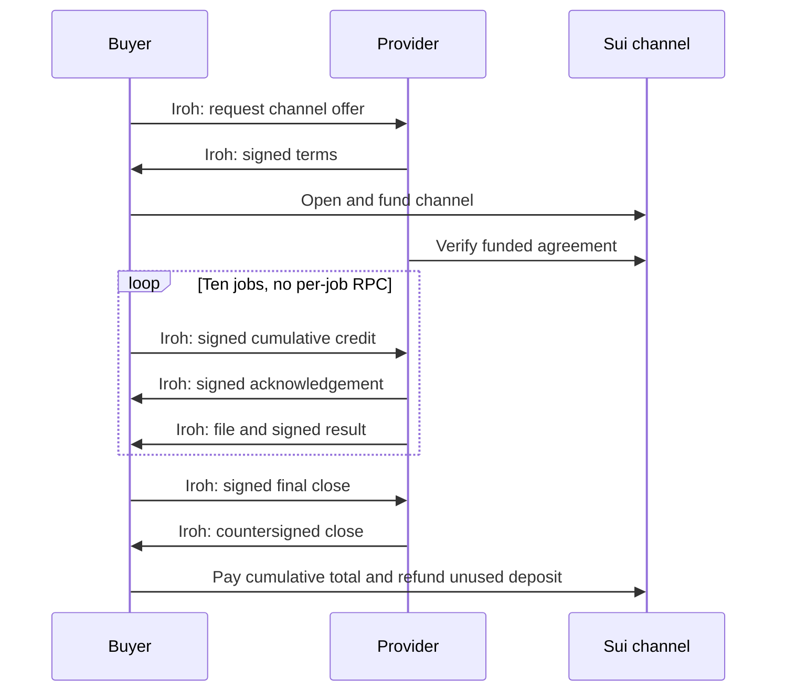

# m2m

A new foundational standard for autonomous software to communicate and transact,
using **Iroh for transport** and **Sui for identity and economic programmability**.
This is the project direction; the implementation is experimental. It includes
native unpaid messaging and generic streaming payments alongside the original
paid-exchange proof of concept. An agent can be an ordinary process, service, or device.

**[Explore every current message](examples/messages/README.md)** ·
[Foundation assessment and plan](docs/FOUNDATION_PLAN.md) ·
[Native core contract](docs/NATIVE_CORE_SPEC.md)

The examples cover native admission, free messaging, service descriptions and
streaming payments, plus all 12 legacy channel and 7 escrow shapes. Legacy channel
`payment.settlement` remains specified-only, with no runtime sender or handler.

## Native implementation

`m2m/core/1` authenticates qualified Agents over Iroh without a deposit. Separate
transport and economic keys bind a standard, negotiated streaming extension to
generic Sui unit/rate policies. Independent Rust/TypeScript peers, durable credit
and delivery recovery, and a real Luna `xhigh` text-worker exchange have passed
local validation. Named testnet provisioning is pending the controlling wallet.

[Run native](docs/NATIVE_QUICKSTART.md) · [Validation and limits](docs/NATIVE_VALIDATION.md) ·
[Streaming contract](docs/STREAMING_V1_SPEC.md) · [Compatibility](docs/NATIVE_COMPATIBILITY.md)

The original native CLI uses a programmed protocol client. The new
[agent-services specification](docs/AGENT_SERVICES_SPEC.md) and
[implementation contract](docs/AGENT_SERVICES_IMPLEMENTATION.md) add coordinator
tool-loop plumbing, bounded research tools, continuing conversations and durable public
events without changing native v1 economic signatures. See the
[runner and validation limits](docs/AGENT_SERVICES_VALIDATION.md).
Live profiles are deliberately blocked before funding until tool isolation is
validated; full live web research also needs separately supplied credentials.
The [Tailwind/Fly investor demo](docs/LIVE_DEMO_PROPOSAL.md) is not deployed.

## Original fixed-file proof of concept

The proof of concept exchanges a fixed test file between two processes over Iroh.
The optional `sui.channel.v1` method reserves one Sui deposit, carries cumulative
payment authorizations alongside ten offchain jobs, and settles the total at
close. It needs no GPU or LLM.

**[Run channels](docs/CHANNEL_QUICKSTART.md)** · [Channel specification](docs/CHANNEL_SPEC.md) ·
[Validation](docs/CHANNEL_VALIDATION.md) · [Implementation plan](docs/CHANNEL_IMPLEMENTATION_PLAN.md) · [Fly Machines PoC](docs/FLY_POC.md)

Payment is a typed message category; the selected settlement method gives it
economic meaning. Iroh transports the messages, and Sui enforces the collateral,
redemption, close, and expiry rules. These are signed channels, without ZK proofs.
The buyer prepays one job at a time; the provider can claim that advance even if
delivery fails. See the [architectural decision](docs/SETTLEMENT_PROFILES.md).

The existing per-job escrow remains available with its original wire format and
acceptance-after-delivery rule: [escrow quickstart](docs/QUICKSTART.md),
[protocol](docs/PROTOCOL.md), and [validation record](docs/VALIDATION.md).
The [Fly experiment](docs/FLY_POC.md) runs separate buyer/provider machines in
Ashburn and Sydney. Cross-region relay transport is verified; direct public-IP
routing was unavailable under the default Fly network configuration.

The first real customer workflow remains open. The current experimental payment
profiles serve known counterparties, using localnet/testnet funds. The intended
core now supports communication without requiring a funded agreement; optional
integrations such as A2A remain separate future adapters.

The [research-agent design proposal](docs/RESEARCH_AGENT_PROPOSAL.md) motivated
the native implementation. Its broader research product behavior is not established
by a successful paid text response.

[Native streaming payments](docs/STREAMING_PAYMENTS.md) are an accepted part of
the intended m2m foundation: reusable funded channels for real-time per-unit
services. The experimental generic implementation is separate from the fixed-file
channel and does not change its prepaid one-job exposure or economic signatures.

Start with the [positioning and problem definition](docs/POSITIONING.md), then
read the [north star](docs/NORTH_STAR.md) and the
[agent protocol research](docs/research/AGENT_PROTOCOLS.md).
The [comparative review](docs/research/M2M_COMPARATIVE_REVIEW.md) and
[implemented message inventory](docs/research/M2M_MESSAGE_INVENTORY.md) distinguish
current capabilities from proposed extensions and upstream compatibility.

The [PoC scope](docs/POC_SCOPE.md) defines the exchange, trust assumptions,
deliverables, failure cases, and acceptance criteria.

[AGENTS.md](AGENTS.md) contains concise working guidance for contributors and
coding agents. The research is a dated reference; the north star should evolve
with evidence and explicit project decisions.
