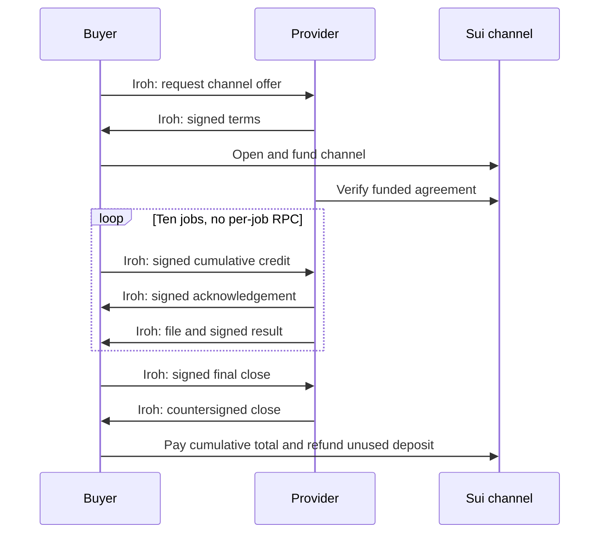

# m2m

Economic coordination for autonomous software, using **Iroh for transport** and
**Sui for economic programmability**.

The proof of concept exchanges a fixed test file between two processes over Iroh.
The optional `sui.channel.v1` method reserves one Sui deposit, carries cumulative
payment authorizations alongside ten offchain jobs, and settles the total at
close. It needs no GPU or LLM.

**[Run channels](docs/CHANNEL_QUICKSTART.md)** · [Channel specification](docs/CHANNEL_SPEC.md) ·
[Validation](docs/CHANNEL_VALIDATION.md) · [Implementation plan](docs/CHANNEL_IMPLEMENTATION_PLAN.md) · [Fly Machines PoC](docs/FLY_POC.md)

Payment is a typed message category; the selected settlement method gives it
economic meaning. Iroh transports the messages, and Sui enforces the collateral,
redemption, close, and expiry rules. These are signed channels, without ZK proofs.
The buyer prepays one job at a time; the provider can claim that advance even if
delivery fails. See the [architectural decision](docs/SETTLEMENT_PROFILES.md).

The existing per-job escrow remains available with its original wire format and
acceptance-after-delivery rule: [escrow quickstart](docs/QUICKSTART.md),
[protocol](docs/PROTOCOL.md), and [validation record](docs/VALIDATION.md).
The [Fly experiment](docs/FLY_POC.md) runs separate buyer/provider machines in
Ashburn and Sydney. Cross-region relay transport is verified; direct public-IP
routing was unavailable under the default Fly network configuration.

The first real customer workflow remains open. This is an experimental protocol
profile for known counterparties, using localnet/testnet funds.

Start with the [positioning and problem definition](docs/POSITIONING.md), then
read the [north star](docs/NORTH_STAR.md) and the
[agent protocol research](docs/research/AGENT_PROTOCOLS.md).
The [comparative review](docs/research/M2M_COMPARATIVE_REVIEW.md) and
[implemented message inventory](docs/research/M2M_MESSAGE_INVENTORY.md) distinguish
current capabilities from proposed extensions and upstream compatibility.

The [PoC scope](docs/POC_SCOPE.md) defines the exchange, trust assumptions,
deliverables, failure cases, and acceptance criteria.

[AGENTS.md](AGENTS.md) contains concise working guidance for contributors and
coding agents. The research is a dated reference; the north star should evolve
with evidence and explicit project decisions.
