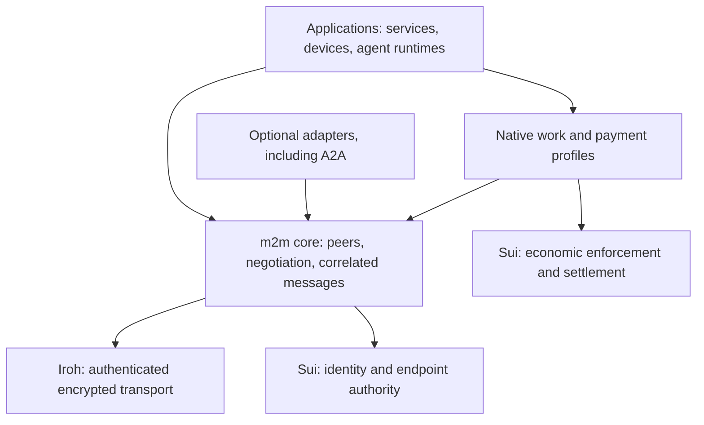

# Native m2m core: first message proposal

**Status: design draft, 2026-09-10. Not implemented, not a released wire contract.**
The accepted direction is a new foundational m2m standard, with Sui and Iroh as
requirements. The particular messages and semantics below are a proposal for
iteration. All currently declared wire types have separate
[validated examples](../examples/messages/README.md).

The subsequent [foundation assessment](FOUNDATION_PLAN.md) identifies the model,
identity/authority, admission, delivery, and compatibility decisions needed before
implementing these sketches. The seven names and illustrative limits below are
design inputs, not a ready implementation backlog.

## The problem the core should solve

An independently operated process needs to contact another durable agent, verify
which endpoint may act for it, learn what it offers, and exchange messages. If
their interaction costs money, they also need explicit terms, bounded authority,
and a recoverable economic outcome. Changing machines or agent frameworks should
not force them to invent a new identity and integration for every relationship.

The proposed core gives those participants a common starting point. Sui supplies
durable identity and programmable economic state; Iroh carries authenticated,
encrypted communication; m2m defines how peer identity, messages, and optional
economic agreements relate. The application may be an ordinary service or device.

The current implementation makes every conversation a paid fixture exchange.
Its envelope requires buyer/provider roles and `sui.channel.v1`; `work.get` can
only retrieve previously agreed fixed bytes. That is useful payment evidence but
too narrow to be the universal core of the intended standard.

## Proposed boundary



The core must allow a free message without opening a channel or escrow. This does
not remove Sui identity requirements. Payment is a typed optional profile with
explicit economic meaning. A generic receipt cannot authorize a debit, and a
payment acknowledgement cannot silently mean a task completed.

Existing channel and escrow formats remain their own versioned contracts. The
current `session.resume` resumes a payment agreement; a future core handshake
establishes a peer session. These are different operations. Carrying the current
channel messages inside a new envelope would require a specified binding, with
the signed BCS statements preserved and context checked at both layers.

## Seven candidate core messages

Names are provisional. The examples below show only **design-sketch bodies**,
using symbolic identifiers such as `msg-01` and `session-01`. They are valid JSON
for discussion, not schema-validated wire messages, valid Sui identities, or
cryptographic proofs. The negotiated authenticated peer context is assumed; it
has not yet been specified. Do not send these over the existing PoC ALPNs.

| Candidate | Purpose | Required distinction |
|---|---|---|
| `core.hello` | Initiator proposes versions and required/optional features | Feature support does not confer authority |
| `core.welcome` | Responder selects a supported contract | Selection must satisfy all mandatory requirements |
| `agent.describe` | Request a known peer's service descriptions | Peer inspection is separate from global search |
| `agent.description` | Advertise services and supported profiles | Advertisements are claims, not grants or performance proofs |
| `message.send` | Deliver a correlated application payload | Application content cannot grant protocol spending authority |
| `message.receipt` | Acknowledge durable acceptance of that message | Receipt is separate from execution, correctness, and settlement |
| `error` | Report a correlated protocol failure | Error handling must preserve uncertainty after disconnects |

### 1. Negotiate a peer session

An initiator requires core messaging, and offers an optional channel binding. The
receiver may select only capabilities it implements. Here it selects a free-message
session, without a payment binding.

```json
{
  "type": "core.hello",
  "id": "hello-01",
  "versions": ["draft-core-0"],
  "required_features": ["message.delivery.draft-0"],
  "optional_features": ["payment.sui-channel-binding.draft-0"]
}
```

```json
{
  "type": "core.welcome",
  "reply_to": "hello-01",
  "version": "draft-core-0",
  "session_id": "session-01",
  "features": ["message.delivery.draft-0"],
  "limits": {"max_payload_bytes": "65536", "deduplication_window_ms": "86400000"}
}
```

The values are illustrative design targets, not measured limits or a new version
claim. Negotiation must bind the intended peers and exact offer/selection to the
authenticated connection. No supported version, a missing required feature, or
failed endpoint authority must fail closed before accepting application messages.
The minimum identity/authentication procedure cannot itself be an optional feature.

### 2. Inspect a known peer

```json
{
  "type": "agent.describe",
  "id": "describe-01",
  "session_id": "session-01"
}
```

```json
{
  "type": "agent.description",
  "reply_to": "describe-01",
  "session_id": "session-01",
  "services": [
    {
      "id": "echo",
      "description": "Return the supplied text",
      "input_media_type": "text/plain; charset=utf-8",
      "output_media_type": "text/plain; charset=utf-8",
      "payment_required": false
    }
  ],
  "supported_profiles": []
}
```

This proposes inspecting a peer already reached through Iroh. It does not define
a global directory or make a claimed service trustworthy. A paid service would
need negotiated terms under a supported payment profile; `payment_required` is
only a description, never an authorization.

### 3. Send an application message and receive its receipt

```json
{
  "type": "message.send",
  "id": "msg-01",
  "session_id": "session-01",
  "conversation_id": "conversation-01",
  "reply_to": null,
  "service": "echo",
  "content_type": "text/plain; charset=utf-8",
  "content": "hello, m2m"
}
```

```json
{
  "type": "message.receipt",
  "reply_to": "msg-01",
  "session_id": "session-01",
  "status": "received"
}
```

The receiver persists the message and duplicate-suppression record before issuing
`received`. It can produce the echo later using another `message.send` with
`reply_to: "msg-01"`. That response needs no additional core message type.

A reconnect must allow the same logical message to be retried under a new session:
deduplication is scoped to authenticated agent pair and message ID, not a transport
stream or session ID. Repeating the same logical content returns a receipt without
re-enqueueing it. Reusing the ID with different logical content is a conflict.
Before implementation, define canonical logical content, retention boundaries,
expiry/replay behavior, crash ordering, and concurrency across authorized endpoints.
After the retention window, a sender cannot assume an old retry is still suppressed.
This proposal does not promise exactly-once application side effects.

### 4. Return a protocol error

This is an alternative branch where the sender retries `msg-01` with changed
content. It is not the response to the successful message above.

```json
{
  "type": "error",
  "reply_to": "msg-01",
  "session_id": "session-01",
  "code": "message_conflict",
  "retryable": false,
  "message": "This message ID was already used with different content"
}
```

The future core needs a closed baseline error vocabulary, extension rules, and
defined retry behavior. Peer text is diagnostic only. Neither an error nor an
absent receipt proves an application action did not happen. A payment profile
must retain its own reconciliation rules. Pre-session errors also need an exact
shape; the established-session example above does not define that handshake path.

## What belongs in profiles

| Area | Proposed placement | What still needs a contract |
|---|---|---|
| General message delivery | Mandatory core | Identity binding, negotiation, bounded payloads, persistence, retries, and errors |
| Economic exchange | Native optional payment profiles | Bind message/work references to exact signed terms; preserve method-specific authority and recovery |
| Long-running work | Future native work profile | Input, status, artifacts, cancellation, partial results, and terminal-state races |
| Delegated authority | Future authority profile plus Sui/local enforcement | Scope, budgets, expiry, revocation freshness, concurrency, and key compromise |
| Streaming / large data | Future transfer profile | Chunk order, integrity, flow control, resumption, and limits |
| Network-wide discovery | Optional directory/indexing layer | Publication, freshness, ranking, privacy, and abuse controls |
| Existing agent protocols | Optional adapters/bindings | Preserve upstream operations, state, errors, security, and version semantics |

These areas are design work, not additional implemented message types. We should
specify their native messages with concrete examples as each profile becomes
defined. This draft deliberately avoids giving an undefined task/delegation API
the appearance of a stable standard. A2A compatibility would require its own
verified binding; carrying a JSON payload does not establish conformance.

## Decisions required before implementing this core

1. **Identity admission:** exact Sui network/package/Agent reference; how Iroh's
   authenticated endpoint is authorized; freshness, rotation, and unavailable-RPC
   behavior. Transport authentication alone does not resolve these questions.
2. **Wire contract:** versioned ALPN, framing, envelope IDs and limits, peer roles,
   canonical encodings, strict parsing, mandatory-feature rejection, and a complete
   handshake including rejection and reconnection. Preserve existing profile bytes.
3. **Evidence:** which general messages need transferable application signatures
   beyond Iroh transport authentication; bind domain, parties, content, expiry,
   and replay scope. Payment statements continue to require their own signatures.
4. **Delivery:** precise receipt guarantee, persistent deduplication, resource limits,
   expiry and crash recovery. Define what happens when multiple endpoints act for
   the same agent, rather than assuming all endpoints share one journal.
5. **Payment composition:** attach an explicit agreement/work reference under a
   negotiated binding; validate it against signed economic statements. Avoid
   interpreting arbitrary application JSON as a debit or acceptance.

The next small implementation could demonstrate two registered agents negotiating,
describing an echo service, exchanging an unpaid message, and recovering a retry
after a restart, followed by a separately specified paid-profile binding. That
would exercise the new foundation without requiring a GPU or inventing a task
scheduler. Acceptance should include an independent peer implementation and
negative vectors, not just two copies of the Rust runtime.

The [comparative review](research/M2M_COMPARATIVE_REVIEW.md) remains dated evidence
about the earlier PoC and alternative paths. Its recommendation to evaluate an
A2A binding predates the accepted native-standard direction. The research still
informs interoperability and prevents unsupported novelty claims; this proposal
does not establish customer demand or production readiness.
