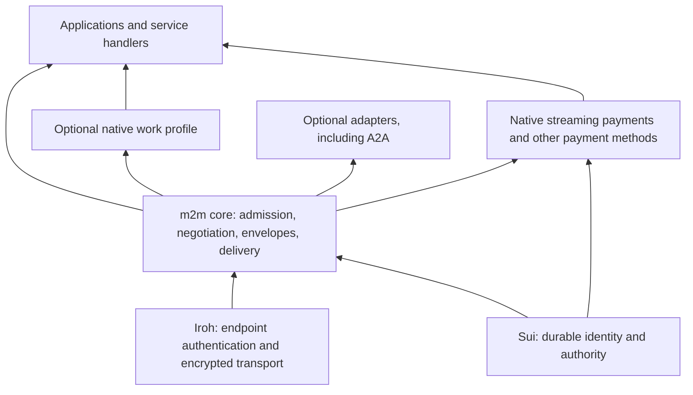

# Building the m2m foundation

Assessment date: 2026-09-10. Code baseline: `c3170df7292a7867f12191bdfea42539e2f89734`.
Status: architectural assessment and recommended work sequence. This document
does not freeze a new wire format, authorize a deployment, or implement a core.
Sui, Iroh, and the native foundational-standard direction remain requirements.

The later [identity and naming recommendation](IDENTITY_AND_NAMING.md) explores
separate communication/economic keys and SuiNS aliases resolving to Agent objects.
It supplies design inputs and upstream evidence for the identity work below;
economic/transport key separation was subsequently accepted on 2026-09-11, while
the detailed lifecycle and naming policies remain proposed. There is not yet a
frozen core or payment binding for these changes.

The [named research-agent proposal](RESEARCH_AGENT_PROPOSAL.md) provides a concrete
next use case to test these boundaries. Its service, pricing, and payment choices
remain proposed and follow the F0–F4 dependency order below.

On 2026-09-11, the user selected [native streaming payments](STREAMING_PAYMENTS.md)
as a built-in m2m primitive across per-unit services. Specify it as part of the
foundation now; its implementation still depends on the identity, messaging, and
recovery contracts below. Unpaid communication remains valid.
The recommended placement is a standard extension on the communication core,
with built-in SDK support and separate economic conformance requirements.

## Assessment

The concern is supported by the code: m2m has working payment applications and
several valuable building blocks, but their shared foundation is not yet a
separately specified, independently usable protocol. Identity checks, connection
admission, message correlation, persistence, and recovery mostly live inside the
escrow and channel workflows.

The PoCs were useful experiments. They established signed-byte compatibility,
economic invariants, recovery behavior, and cross-region connectivity. The mistake
would be allowing their fixed-file workflow to become the implicit definition of
an agent protocol. Their success does not settle what any two m2m agents must
understand before they negotiate a particular application or payment method.

The recent seven-message core draft improves the vocabulary, but it also makes
premature choices: a session shape, durable receipts, and illustrative limits
without complete identity, authority, delivery, and compatibility contracts.
Those sketches should be inputs to this work, not an implementation backlog.

**Recommended change in sequence:** specify the shared behavioral contracts,
implement a small core against them, prove it independently, and then bind the
existing payment methods to it. Preserve the PoCs as economic profiles and
regression evidence throughout this process.

## What the repository actually provides

| Area | Existing evidence | Foundation still needed |
|---|---|---|
| Durable identity | A shared Sui `Agent` object with a controller, one endpoint key, and controller-authorized key replacement | General identity/authority lifecycle and resolution contract; identity is currently defined inside `exchange` and contains escrow nonce/job state |
| Endpoint authentication | Iroh connections expose the remote endpoint key; payment handlers check the registered or agreement-snapshot key | Reusable mutual agent admission independent of a quote, channel, or fixture |
| Authority | Controller-funded agreements snapshot keys and bound their economic rights | Explicit distinction between current communication rights, permission to invoke a service, and existing settlement rights |
| Encoding and signatures | Strict channel types, BCS statements, signing domains, and cross-language vectors | Core envelope and evidence rules independent of buyer/provider roles and a settlement method |
| Connectivity | Tickets, bounded request/response streams, timeouts, and direct/relay controls | Generic Iroh binding, version negotiation, symmetric peer behavior, and reconnect semantics |
| Reliability | Durable writes, process locks, saved credits/results, reservations, and reconciliation | Application-neutral message IDs, delivery outcomes, duplicate handling, retention, and crash recovery |
| Application interface | A parameterless `ServiceHandler.execute()` returning precommitted file bytes | A service interface accepting typed input and context without importing channel state |
| Implementation packaging | Rust modules and TypeScript Sui adapters with CLI orchestration | A reusable API and typed interfaces for identity resolution, storage, transport, and optional profiles |
| Conformance | Schemas, public vectors, validated examples, Rust/Move tests, and recorded network experiments | A core test matrix, independent peer implementation, automated checks, and versioned release requirements |

Concrete source anchors:

- [Agent definition and lifecycle](../move/m2m/sources/exchange.move#L37): `Agent`
  includes `next_nonce` and `jobs`; `register` shares it and `replace_endpoint`
  checks the stored controller. Its controller authority comes from module checks,
  not an assumption that the shared object is address-owned.
- [Channel envelope](../src/channel_protocol.rs#L787): fixed `buyer`, `provider`,
  `agreement_id`, and `method`; validation requires `sui.channel.v1`. Offers may
  precede funding, but there is no general message outside this economic workflow.
- [Channel admission and recovery contract](CHANNEL_SPEC.md#credits-work-and-durable-session-rules):
  sessions reconcile a specific channel and its original key snapshot.
- [Provider dispatch](../src/channel_runtime.rs#L2525): transport, admission,
  economic processing, and wire responses are coordinated in the channel runtime.
  Error codes are selected partly by matching words in error strings, which is
  unsuitable as a stable generic error contract.
- [Transport/provider module](../src/transport.rs#L91) and
  [service boundary](../src/service.rs#L5): the provider embeds price, chain, signer,
  storage, and the fixed-file handler; the handler has no request arguments.
- [Durable store](../src/store.rs#L19): process locking and sync/rename writes are
  reusable primitives. They do not define a generic inbox or distributed ownership.
- [Escrow chain adapter](../src/chain.rs#L42) and
  [channel bridge](../src/channel_runtime.rs#L875): both start repository-relative
  Node/TypeScript scripts. This is a workable PoC integration, not yet a portable
  library contract. The [Sui adapter](../scripts/chain.ts#L44) already validates
  chain, deployment, and object type; preserve those checks.
- [Message inventory](research/M2M_MESSAGE_INVENTORY.md),
  [examples](../examples/messages/README.md), and
  [validation record](CHANNEL_VALIDATION.md): distinguish implemented behavior
  from schema declarations and measured evidence. `payment.settlement` still has
  no runtime sender/handler despite its specification entry.

At this baseline, Cargo publication is disabled, the npm package is private, and
there are no tracked license, contribution, security-reporting, or `.github`
workflow files. This is also an unfinished standardization surface, separate from
whether the PoC exchanges work.

## The architecture to work toward

Dependencies run from applications and profiles down to the core and its Sui/Iroh
bindings. The core must not import a channel transcript, fixture hash, payment
sequence, or provider price to establish a peer session or deliver a message.
It can define how extensions are named and correlated without understanding their
economic state machines. Payment remains a first-party part of m2m's design.

The standard defines observable behavior and required checks. A reference SDK
implements that behavior. A daemon is one optional packaging choice; another
implementation must be able to embed the SDK in an existing process. Iroh already
provides the transport foundation, and Sui the chain foundation; this work is
about the missing m2m contracts between them and their applications.

## Foundation work, in dependency order

### 1. Protocol model, boundaries, and threat model

Write a small normative model before extending the wire enum. Define an agent,
controller, operational endpoint, authenticated peer session, logical message,
service, work item, and economic agreement. State which references survive a
reconnect, process restart, endpoint rotation, or deployment change.

Keep separate state machines for connection/admission, message delivery,
application work, and settlement. Define a mandatory core and how optional
profiles attach. An agent can send an unpaid message; serving a request can still
require local permission. An advertisement does not grant authority.

The threat model must cover a lying peer, substituted routing ticket, stale chain
state, compromised endpoint, replay, disk loss, RPC/relay outage, and resource
exhaustion. Distinguish what cryptography proves from what depends on local
storage, trusted chain access, the application, or an upgrade authority.

**Deliverables:** protocol model, trust-boundary diagram, invariants, explicit
non-goals, and decision records for the choices in the following sections.
**Exit:** every required guarantee has an enforcing component and a failure case;
the model permits unpaid communication without buyer/provider roles.

### 2. Identity, authority, and resolution

Specify a qualified Agent reference including chain/deployment context, accepted
object types and versions, controller authority, endpoint authorization, and
rotation behavior. An object ID by itself is not a complete trust configuration.
Define whether one endpoint may represent several agents, and require the claimed
agent to be explicit even when keys match.

Separate three operations: finding an authorized key, finding network routes for
that key, and discovering advertised services. Routing hints never grant authority.
Known-peer bootstrap is sufficient initially; a global directory is not required.
Specify trusted RPC/checkpoint inputs, cache freshness, and unavailable-chain
behavior rather than implying that an RPC response is a trustless proof.

Recommended initial limit: one active communication endpoint and one state writer
per agent, with controller-authorized replacement. Keep multi-endpoint delegation
and shared spending budgets as extensions until their concurrency rules exist.
Define controller loss, transfer/recovery, and agent retirement explicitly, even
if the first version marks some operations unsupported.

For new communication, decide when an authorization lease expires and when a peer
must revalidate it. Rejection after revocation is meaningful only with a stated
freshness bound; an offline cache cannot supply instant revocation. Endpoint
rotation does not migrate an inbox or application memory by itself.

Existing channel rights need separate treatment: they deliberately retain the
original keys for a fixed deposit and deadline. Revoking a communication endpoint
must not silently invalidate outstanding signed credits or erase a counterparty's
claim. See [current authority rules](CHANNEL_SPEC.md#authority-and-trust).

**Deliverables:** identity/authority specification, resolution interface and test
fixtures, lifecycle matrix, and an onchain compatibility decision. Separating the
concepts does not justify moving the published `Agent` type or changing its ABI.
Use a compatibility view initially if it satisfies the contract; a later new
package/type needs explicit identity mapping, migration, and recovery rules.
**Exit:** two implementations agree on the authorized actor for valid, stale,
rotated, wrong-chain, and wrong-deployment inputs, without payment state.

### 3. Wire, cryptographic evidence, and peer admission

Define core versioning, ALPN, stream framing, canonical field encodings, maximum
sizes, message IDs, response correlation, and extension namespaces. Decide which
context is on every message and which is bound to an admitted session. Specify
unknown fields, unknown types, duplicate JSON keys, malformed values, and integer
precision; strictness must be consistent across implementations.

Specify both sides of the handshake, including rejection before a session exists,
identity checks, mandatory-feature selection, downgrade rejection, and the order
in which application traffic becomes legal. Either agent should be able to send
application messages; initiator/responder are connection roles, not permanent
buyer/provider identities. Define concurrent streams, connection shutdown, and
whether any message order is promised across streams.

Iroh endpoint authentication and transferable application signatures serve
different purposes. Specify which core statements need signatures, the canonical
bytes/domain and replay scope, and how they bind both parties and content.
Authenticated transport alone cannot produce evidence another party can later
verify. Conversely, signing every JSON envelope is not a substitute for defining
its semantics. Preserve existing payment BCS statements exactly.

**Deliverables:** wire/security specifications, handshake state table, schemas,
typed errors, and positive/negative vectors produced from the contract.
**Exit:** peers can accept or reject admission deterministically, and malformed,
unsupported, replayed, or misbound traffic cannot reach a service handler.

### 4. Delivery, persistence, and resource bounds

Define what success means for a logical message. A transport write, receiver
admission, durable receipt, completed work, and settled payment are different
events. A timeout leaves an uncertain outcome. Document which actions can be
retried and when a status/replay exchange is necessary.

Recommended initial general-message guarantee: bounded durable receipt between
known peers, using a single writer and persistent inbox/outbox. Do not promise
exactly-once application effects or arbitrary offline mail delivery. Confirm this
choice in a decision record before adopting the earlier `message.receipt` sketch;
it makes storage a real implementation obligation.

Specify duplicate identity/content checks, persistence-before-receipt ordering,
retry after reconnect, receipt retention, expiry, and restart after partial writes.
Deduplication must survive a session change. Define the logical content commitment
so replacing transport/session metadata does not turn a retry into new work.
Once retention ends, reject expired retries or report uncertainty according to a
defined rule; never promise indefinite duplicate suppression.

Bound inbox bytes, concurrent streams, admission RPC work, payload size, pending
requests, and receipt retention. Define overload responses and backpressure.
Identity authentication does not mean a peer may consume unlimited resources.
Define journal corruption/loss behavior and application handoff: delivery
deduplication alone cannot prevent repeating an external side effect after a crash.

**Deliverables:** delivery state machine, storage interface, crash matrix, typed
retry/overload errors, and reproducible resource-limit tests.
**Exit:** lost receipts, retries, restart, expiry, and disk/queue limits have
predictable outcomes; uncertain history never authorizes invented success.

### 5. Service and profile composition

Define service descriptions, media types/input schemas, request context, and
application error boundaries. Distinguish advertised services, negotiated
protocol features, and permission to invoke an operation. Start with descriptions
of known peers and small parameterized request/reply services.

Define a profile registration/dispatch boundary and correlation with work and
economic agreements. A profile can impose stronger signing, authority, delivery,
and persistence requirements; it cannot silently weaken the core or grant itself
permission to spend. Generic application content must not be interpreted as a
payment authorization by accident.

Long-running tasks, cancellation, streamed artifacts, delegation, marketplace
search, actual ZK proofs, and A2A adapters can then get separate specifications.
They are not prerequisites for two agents to communicate. The foundational API
should not require an LLM, GPU, task scheduler, or particular agent framework.

**Deliverables:** service interface and profile-binding contract; compatibility
map for the escrow/channel methods; a specification decision resolving the
`payment.settlement` gap before claiming full channel conformance.
**Exit:** the same core serves two different small applications, and an optional
payment binding preserves its original economic invariants without modifying the
core delivery engine.

### 6. Reference implementation and conformance

Create conceptual boundaries for protocol types, identity resolution, Iroh
binding, delivery/storage, and profile dispatch. These can begin as modules in
this repository; multiple crates and a directory reorganization are not evidence
that the architecture exists. Define observable behavior first, then extract
reusable implementation behind those interfaces.

The core should be usable from a process outside the source checkout. Make chain,
storage, clocks, and application handlers explicit dependencies, rather than
hard-coded repository paths. Keeping the TypeScript chain adapter is acceptable
if its packaging and typed interface are deliberate; a Rust-only rewrite is not
a prerequisite.

Build automated schema/vector, state-machine, crash/replay, and end-to-end checks.
Maintain a requirements-to-tests matrix and separate core conformance from each
profile's conformance. A second implementation should independently encode and
process core messages over Iroh, possibly sharing an Iroh transport bridge but not
the core parser/state machine. Cross-language signing vectors alone are not full
peer interoperability.

In parallel, define specification ownership/change review, version compatibility,
extension registration, vulnerability reporting, release criteria, and explicit
licensing decisions for code and specifications. License selection remains a
project-owner decision; this assessment does not choose one.

**Deliverables:** embeddable core, independent peer/harness, automated checks,
interoperability report, and contributor/release documentation.
**Exit:** another implementer can follow the spec, exchange messages, reproduce
failure outcomes, and identify supported profiles without reading our runtime.

## Recommended execution sequence

These are proposed work packages, not new accepted wire requirements. Conformance
fixtures and tests should be designed alongside each specification, not postponed
until implementation is finished.

| Milestone | Concrete work | Depends on | Completion evidence |
|---|---|---|---|
| F0: contract decisions | Model, threat boundaries, core/profile split; settle identity leases, receipt guarantee, initial endpoint limit, and signature policy | This assessment | Decision records, invariants, state diagrams, and a requirements/test matrix; no invented unresolved fields hidden in examples |
| F1: identity and admission | Specify and implement qualified identity resolution, authorization freshness, negotiation, wire parsing, and typed rejection | F0 | Valid and invalid admission vectors; wrong/stale endpoint and unsupported-version tests; no payment agreement needed |
| F2: usable core | Implement symmetric message delivery, bounded persistence, recovery, service dispatch, and embeddable interfaces | F1 | Two parameterized free services; restart/retry, conflicting duplicate, expired retry, and resource-limit tests |
| F3: independent core conformance | Run a second implementation through the core matrix and repair ambiguities | F1/F2; begin its design with F1 | Independent Iroh peers interoperate, including negative and recovery paths |
| F4: payment composition | Specify and implement binding for one existing payment method, then the other; resolve declared-message gaps | F3 plus binding specification | Free messages and paid exchange share the core; prior signing and economic invariants still pass |
| Release work, parallel | CI, license decision, contribution/security process, version/extension policy, packaging | Begin with F0; required before a public standard release | Reproducible conformance report, installable implementation, and reviewable release contract |

F0 is the immediate next work package. It should produce the model, threat model,
identity/authority contract, and core state-machine decisions before implementing
the seven draft message names. F1/F2 will still use small executable experiments,
but those experiments will test a written foundation contract.

Treat F4 as composition, not a rewrite of the tested economics. A new binding must
reconcile the current-agent admission policy with the old channel's snapshot
rights, including post-rotation recovery. Retain existing ALPNs and recovery paths
until that mapping is proven. Do not relabel old messages as the new core version,
change signed bytes in place, or move the existing Move identity type casually.

## What to keep and what to defer

Keep the signed statement codecs/vectors, chain/deployment checks, durable-write
primitives, explicit economic state machines, fault-injection scenarios, and Fly
evidence. Extract reusable parts incrementally; leave profile-specific commitments
and journals inside their profiles. No funded experiment or operational key is
needed for the immediate specification work.

Defer additional payment mechanisms, inference provisioning, global discovery,
multi-writer identities, general task orchestration, and actual ZK machinery
until a concrete profile needs them. Continue correcting relevant defects in the
existing PoCs, but do not make completing another payment feature the critical
path to defining the core.

The largest design risks are authorization freshness versus connectivity,
identity/ABI evolution, and delivery guarantees versus storage and concurrency.
Writing JSON message types is the smaller part. Calendar estimates would be
premature until F0 settles these choices; the milestones above define reviewable
units of work without assuming those decisions are already made.

## Definition of a working foundation

Two independently implemented agents can resolve and authenticate one another,
agree on a version, inspect a known peer's service, exchange an unpaid application
message, and recover from a lost reply or process restart under explicit bounds.
Wrong authority, stale identity, incompatible features, conflicting retries, and
overload have specified outcomes. Changing the service does not change the core.
Adding a payment method attaches explicit economic authority without redefining
what a peer, message, receipt, or reconnect means.

That is the foundation the existing PoCs should eventually stand on.
