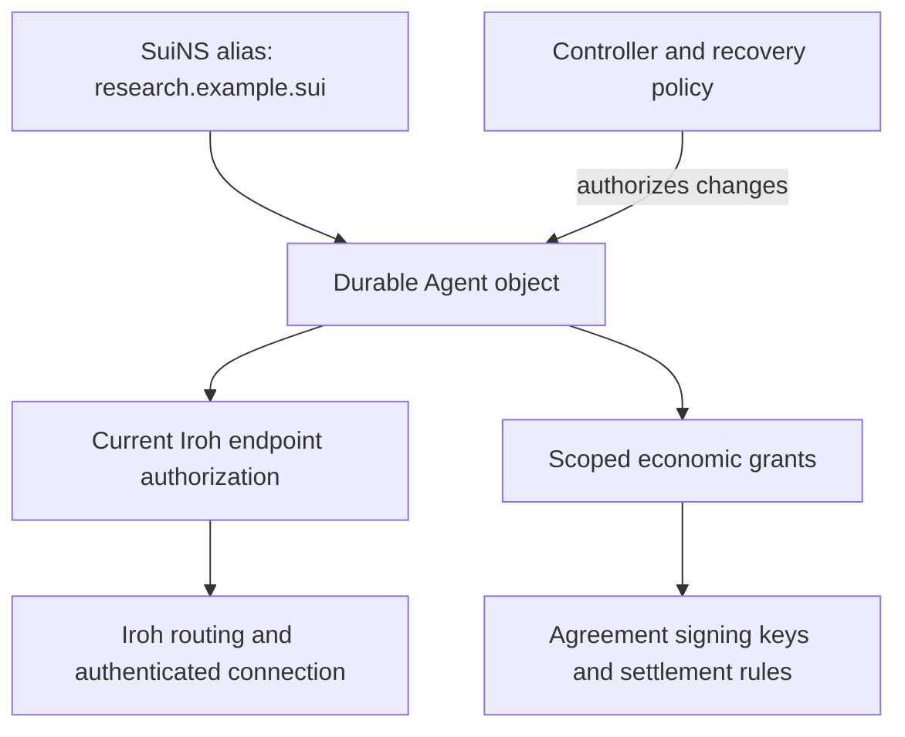

# Agent identity, endpoint rotation, and SuiNS

Status: economic/transport key separation was accepted by the user on 2026-09-11.
The naming binding and detailed lifecycle policies remain recommendations.
This develops the identity work in the [foundation plan](FOUNDATION_PLAN.md);
it is not implemented or a replacement for the existing channel contract. m2m baseline:
`a8b2cda6eccdd034cd539b79fa80c737981e4d3c`.

Implementation update, 2026-09-11: a narrower experimental
[native naming binding](NATIVE_NAMING_SPEC.md) and separate Agent package now exist.
See [validation](NATIVE_VALIDATION.md) for local evidence and pending named testnet
provisioning. The broader recommendations below retain their original status.

## Recommendation

Use a qualified Sui Agent object as the durable identity. Authorize replaceable
operational keys from that identity. Use SuiNS as an optional human-readable alias
that resolves to the Agent object. Keep controller authority, communication keys,
economic signing authority, and settlement destinations distinct.



Names in this document are illustrative; their availability or ownership has not
been checked. SuiNS should be a supported resolution option, not a requirement to
purchase a name before participating. Direct qualified Agent references must work.

## What each identity means

| Reference | Intended purpose | What can change independently |
|---|---|---|
| SuiNS name | Human-facing alias and namespace membership | Target, holder, validity, and presentation |
| Qualified Agent ID | Durable protocol actor: chain, deployment/type context, object ID | Authorized endpoints and supported controller policy |
| Controller authority | Configure the Agent and authorize operational grants | Controller/recovery arrangement, if explicitly supported |
| Iroh endpoint ID | Authenticate the process reached over the transport | Changing its key creates a new endpoint ID; changing routes need not |
| Economic signing grant | Authorize exact economic actions within a defined agreement or budget | Renew, narrow, or replace grants under the method's rules |
| Payee/refund address | Receive funds under an agreement | Fixed by the signed agreement; never inferred from a display name |

Iroh identifies an endpoint by its Ed25519 public key. Persisting its secret key
preserves that identity across restarts. Address lookup separately supplies the
current dialing details; it must be configured, or the application must provide
routes. SuiNS resolution alone does not make an endpoint reachable.
[Iroh endpoint documentation](https://docs.iroh.computer/concepts/endpoints)

An Agent object ID, a controller's Sui address, and an endpoint public key are
different references even when keys use Ed25519. A controller can operate several
Agents, and one Agent should survive routine operational-key changes. The current
[Agent module](../move/m2m/sources/exchange.move#L37) already separates controller,
object ID, and endpoint key, but combines identity with escrow bookkeeping and
does not implement the lifecycle described here.

## Ideal rotation model

The reference design must separate transport key T1 from economic signer P1.
Both may use Ed25519; their role separation should be explicit and their private
keys should be independently replaceable. Compromise of a transport-only key
must not, by itself, authorize a payment signature. Compromise of a whole process
that can access both keys still compromises both roles; isolation of signers is
an implementation concern with real security consequences.

An Agent's communication authorization should identify the endpoint key, an
authorization generation, activation/expiry policy, and permitted role. Peers
bind the claimed Agent and negotiated session to that authorization and the
actual remote Iroh key. They must not infer unrestricted spending or permission
to invoke every service merely from a successful transport handshake.

For a planned rotation, provision T2, have the controller authorize it, reconnect
through T2, then retire T1 under a specified cutover rule. The durable Agent ID and
SuiNS alias remain unchanged. An initial core can permit a single active endpoint
and a brief interruption; seamless overlap requires its own concurrency rules.
Preserving message history across the handover requires state migration or shared
storage. Changing the key does not transfer an inbox.

For compromise, stop accepting T1 for new general interactions once its revoked
authorization is observed. Specify a maximum authorization-cache lifetime and
revalidation behavior on existing sessions as well as new connections. An offline
peer cannot discover revocation immediately. Once freshness expires, it should
stop granting new authority until it can validate state again. Do not confuse a
valid name cache with a fresh endpoint authorization.

Keep P1's existing economic rights governed by its agreement. A future binding
could carry P1-signed statements over a connection authenticated as T2, after
checking the Agent, agreement, signer scope, and current communication authority.
Transport rotation then need not disrupt payment signing.

This is a change from the current PoC, which snapshots endpoint keys for both
transport admission and economic signing. Its existing credits and recovery paths
must retain their original meaning. A compatibility binding must explicitly allow
the required old-key recovery without granting general Agent authority.
[Current channel authority and trust](CHANNEL_SPEC.md#authority-and-trust)

If P1 itself is compromised, independent transport keys do not fix the funded
channel. The current method bounds exposure by deposit and deadline, and an old
key can authorize remaining collateral. Revoking P1 cannot simply erase valid
previous authorizations. Stronger emergency economic revocation would require a
new method with an explicit freeze/dispute/settlement rule and reviewed tradeoffs.
No instantaneous or retroactive revocation guarantee is proposed here.

Controller rotation and recovery also need a specified authority transition and
generation. An Agent object does not automatically recover a lost controller.
Whether control can transfer, and how counterparties react to a control change,
must be explicit before treating a stable object ID as continuity of the operator.

## Why a name should resolve to an Agent object

| Candidate target | What it names well | Fit for the durable m2m actor |
|---|---|---|
| Iroh public key | One cryptographic transport endpoint | Poor default: key replacement changes the identity being named; application state and economic authority need another binding |
| Controller/wallet address | An account controlling assets or multiple Agents | Ambiguous: it does not select which Agent, and account changes become part of every resolution path |
| Agent object ID | A persistent actor with explicit controller and operational authority | Recommended: name and endpoint changes can happen independently while work/agreement references stay stable |
| Naming record/NFT itself | The current right to configure a name | Poor protocol identity: naming lifecycle and actor lifecycle become coupled |

Names remain optional aliases. Signatures, journals, allowlists, and agreement
participants should use qualified Agent IDs and the relevant authority/agreement
context. A name can be included for display, but must not be re-resolved later to
choose who owns an old obligation or receives a payment.

## What SuiNS can provide today

SuiNS explicitly supports a name resolving to an address **or an object** through
its target-address record. Naming authority can set that target; owning a name
does not establish control of its target. The integration guide distinguishes
forward resolution from default-name reverse lookup.
[SuiNS integration guide](https://docs.sui.io/sui-stack/suins/developer#resolution-types)

The current SDK exposes name records, including their target, registration
reference, expiration, and supported metadata. Its client-extension integration
can use Sui gRPC clients, fitting the repository's existing adapter direction.
This is documented support, not an integration test performed in m2m.
[Querying](https://docs.sui.io/sui-stack/suins/developer/sdk/querying),
[SDK integration](https://docs.sui.io/sui-stack/suins/developer/sdk)

Subnames provide organizational structure. Node subnames have their own
registration capability; leaf subnames are managed by their parent and can be
removed by that parent. The parent/expiry rules matter for any claim of namespace
affiliation. These naming permissions do not delegate Agent execution or funds.
[Subname model](https://docs.sui.io/sui-stack/suins/developer#subname-types),
[subname transactions](https://docs.sui.io/sui-stack/suins/developer/sdk/subnames)

Potential m2m benefits, inferred from those capabilities:

- **Readable bootstrap:** share `research.example.sui` instead of an object ID.
- **Organizational naming:** use sibling names for research, monitoring, and data
  services, each resolving to its own durable Agent.
- **Independent naming administration:** a team can manage aliases separately
  from the controller and keys operating the Agent.
- **Continuity through endpoint changes:** the name continues pointing to the
  same Agent while its operational authorization changes.
- **Presentation and indexing:** show validated names in logs and interfaces;
  optionally index names for discovery. A directory remains a separate service.

These benefits do not establish work quality, human organizational identity,
reputation, endpoint availability, or spending authority. A name owner can point
an alias at someone else's Agent. Label that as forward resolution; require the
Agent's own acknowledgement before presenting it as an Agent-adopted name.

## Recommended initial SuiNS binding

Use a dedicated agent name or subname whose standard `targetAddress` is the Agent
object ID. Keep a general organizational payment name separate, for example:

```text
example.sui            -> organization's wallet target
research.example.sui   -> research Agent object
monitor.example.sui    -> monitoring Agent object
```

These are naming examples, not instructions to register or change records. An m2m
resolver must fetch and validate the target object's type, protocol version,
chain/deployment, and authority. A 32-byte target alone does not establish that it
is an m2m Agent. Raw endpoint-key bytes placed in an address field must not be
silently accepted as an Agent reference.

A generic wallet also sees the standard target address. It will not automatically
follow m2m economic terms to find the Agent's payee. Therefore, do not present an
Agent-targeting name as a universal payment destination. m2m payments use validated
agreement recipients, while interfaces identify an alias's target type clearly.

Do not assume arbitrary application text records are available. At the inspected
SuiNS contract revision, `set_user_data` only accepts `avatar`, `content_hash`, and
`walrus_site_id`; the SDK also checks an allowlist. A proposed `m2m.agent` metadata
key is not currently a drop-in public API. It would need upstream support or a
separate specified binding. Avoid repurposing an existing metadata field.
[Pinned controller source](https://github.com/MystenLabs/suins-contracts/blob/692a12c02260fd4abecf1630d33db819e4bcadef/packages/suins/sources/controller.move#L78),
[SDK setter](https://github.com/MystenLabs/ts-sdks/blob/7b086bbf19cd9f8cdd05b619f2180751e3f5f93e/packages/suins/src/suins-transaction.ts#L522)

SuiNS also has object reverse-lookup setters that require a mutable reference to
the object's UID; registry checks require the name's target to match that object.
This is a possible way for an Agent to adopt a default alias, provided the Agent's
module exposes a correctly controller-authorized operation. The current m2m
module does not expose that integration. Plain wallet `setDefault` is not a
substitute for object-authorized reverse lookup.
[Object reverse lookup](https://github.com/MystenLabs/suins-contracts/blob/692a12c02260fd4abecf1630d33db819e4bcadef/packages/suins/sources/controller.move#L65),
[registry match check](https://github.com/MystenLabs/suins-contracts/blob/692a12c02260fd4abecf1630d33db819e4bcadef/packages/suins/sources/registry.move#L277)

An alternative is an m2m-specific controller-approved alias record on the Agent.
Choose one authoritative adoption mechanism in the binding spec. In either case,
verify the live forward mapping and name validity as well; a reverse/display
record alone is insufficient. Object-adopted naming proves an alias relationship,
not the real-world identity of the organization behind the name.

## Resolution and continuity rules

Recommended resolver sequence:

1. Normalize the name with the selected SuiNS rules and require an explicit
   network context. Resolve a supported name record with trusted state provenance.
2. Validate name existence and lifecycle, including applicable parent records for
   leaf names. Reject absent targets, expired/invalid records, and unresolved
   authority. A grace period is not permission to use an expired alias.
3. Fetch the target Agent and validate its type, deployment, version, lifecycle,
   and current controller/endpoint authorization. Record the qualified Agent ID.
4. For an existing relationship, compare with the pinned Agent ID. A name now
   pointing elsewhere is a different actor unless an explicit application policy
   authorizes that change. A headless agent should fail with a typed identity-change
   outcome rather than silently reuse the old actor's budget or trust.
5. If displaying an Agent-adopted alias, validate the corresponding Agent-side
   acknowledgement. Record name provenance separately from Agent authority.
6. Resolve Iroh routes, authenticate the endpoint key, and bind the handshake to
   the Agent and current communication authorization. Independently enforce any
   service or economic grant needed for the requested action.

Name leases expire and require renewal; the documented grace period is 30 days.
A later registration may give the same string to someone else. Therefore,
retain the naming snapshot used at initial discovery, but anchor durable
relationships to the Agent rather than the alias.
[SuiNS renewal lifecycle](https://docs.sui.io/sui-stack/suins/user#renewal-grace-period)

The inspected SDK's `getNameRecord` decodes and returns a raw record without
performing expiry or leaf-parent validity checks in that method. A successful
fetch is not full resolution validation. Leaf records use a special expiration
marker and reference the parent registration; m2m must apply the pinned SuiNS
rules or use a resolver that does so, instead of checking only a leaf timestamp.
[Pinned SDK read path](https://github.com/MystenLabs/ts-sdks/blob/7b086bbf19cd9f8cdd05b619f2180751e3f5f93e/packages/suins/src/suins-client.ts#L200),
[leaf record structure](https://github.com/MystenLabs/suins-contracts/blob/692a12c02260fd4abecf1630d33db819e4bcadef/packages/suins/sources/name_record.move#L44)

Registration NFT identity alone is not an ownership-change detector: transfer
need not create a new NFT. If an application uses current namespace control as a
trust signal, it must validate that control and the relevant delegation lifecycle
separately. Do not equate a cached registration ID with current brand endorsement.

| Event | Required continuity behavior in the proposed design |
|---|---|
| Same endpoint key moves machines | Refresh routes; preserve Agent and endpoint identities |
| Transport key rotates | Preserve Agent and name; refresh communication authorization and sessions |
| Economic signer changes | Follow the method's rules for old and new obligations; preserve valid claims |
| Name expires or is removed | Stop treating it as a valid live alias; retain the pinned Agent and existing agreements |
| Name resolves to another Agent | Treat as retargeting; do not silently inherit the previous Agent's trust or budget |
| Agent controller changes | Surface a control-generation change; apply explicit continuity policy |
| SuiNS unavailable | A previously pinned Agent can still be used if its authority can be validated independently; first-time name resolution remains unavailable |
| Sui authority freshness expires | Do not grant new communication/economic authority based solely on cached naming information |

## Work to add to the foundation plan

Before implementation, settle the qualified Agent reference, controller/recovery
model, communication authorization generation and freshness, the grant contract
for the accepted separate economic signers, and the current-channel compatibility
boundary. Then specify
the optional SuiNS binding: normalization, network context, target type, lifecycle,
adopted-name validation, retargeting errors, and payment-destination semantics.

Initial implementation can use one communication endpoint, one writer, and
dedicated Agent-targeting names. Defer concurrent multi-endpoint operation and
new metadata formats. SuiNS should attach through the identity resolver interface;
the core must continue to accept unnamed Agents.

Acceptance cases should include wrong target type/network, name retargeting,
expired parent/leaf records, stale reverse records, endpoint rotation during a
session, a compromised transport key attempting payment authorization, cached
authorization expiry, and recovery of an old channel after a communication-key
change. Test names and objects should be local fixtures first; deployment and
funded name operations are separate integration work.

## Research provenance and limits

Official SuiNS/Sui and Iroh documentation was checked on 2026-09-11. Source checks
used `MystenLabs/suins-contracts` commit
`692a12c02260fd4abecf1630d33db819e4bcadef` and `MystenLabs/ts-sdks` commit
`7b086bbf19cd9f8cdd05b619f2180751e3f5f93e`. Those repository snapshots are evidence
of source behavior, not a bytecode audit of every live deployment or an installed
SDK compatibility test. Pin the actual network packages and SDK release before
implementing. No names were registered, records changed, keys rotated, or funded
transactions submitted for this assessment.
