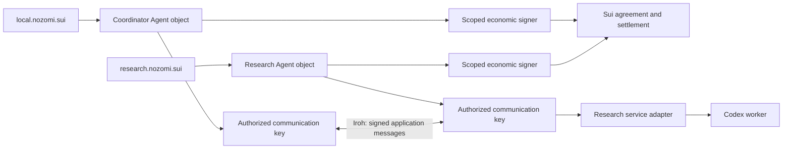

# Named research agents: service, pricing, and settlement

Date: 2026-09-11. Repository baseline: `61b7562bd0012001f58217500ab6dfef8525a921`.
Status: proposed next use case and architectural recommendation, prompted by the
user's local coordinator / remote Codex research-agent example. This is not an
implemented profile, frozen wire contract, or deployment plan. The
[foundation plan](FOUNDATION_PLAN.md) supplies the prerequisite contracts.

Later implementation update, 2026-09-11: [native core and streaming validation](NATIVE_VALIDATION.md)
now includes a live, byte-metered Codex text worker with a programmed coordinator.
That narrower implementation does not establish all behavior proposed here.
The user's subsequent [live investor-demo requirements](LIVE_DEMO_PROPOSAL.md)
require two real LLM decision loops, not a scripted coordinator.

## Recommendation

Use this workflow to test whether m2m's foundation composes: two named Agents,
independent communication and economic keys, useful parameterized work, optional
pricing, and recoverable payments over Iroh. The user clarified the intended
economic flow: the buyer funds a channel, and responses are paid incrementally
in real time through signed offchain channel updates. Adapt that tunnel flow to
m2m; task-completion approval is not its payment trigger. The m2m research binding
is not implemented. Free work remains a foundation check, not a replacement for
the intended metered channel workflow.

The user also selected [streaming payments](STREAMING_PAYMENTS.md) as a built-in
m2m primitive applicable across per-unit services. Research supplies its pricing
and metering policy and Codex adapter; it uses the shared channel machinery.
The recommended packaging is a standard m2m extension built on the communication
core and shipped with the SDK; the core itself does not maintain channel balances.

Keep three choices separate above the core:

| Choice | What it defines | Example |
|---|---|---|
| Service/work profile | Inputs, conversation continuity, progress, results, cancellation | Research question and cited answer; Codex is the provider's execution adapter |
| Pricing/metering policy | Billable events or units, rates, limits, and usage evidence | Free; fixed price per turn/task/session; input/output token rates |
| Settlement method | Who can claim what funds, with which signatures, at what time | Funded channel with incremental credits and usage receipts; acceptance-based escrow as another profile |

The m2m core defines identity, admission, feature negotiation, signed messaging,
correlation, and delivery behavior. It need not understand tokens, model names,
research quality, or the calculation of a bill. Optional profiles must still have
interoperable schemas and semantics: extensibility does not mean opaque pricing
strings that buyers cannot evaluate. Unsupported required policies must fail
negotiation before work or payment authorization.

The research service should be usable with several policies, and a reusable
payment method should support several services. A connection, a research
conversation, a work item, and a funded agreement are different lifecycles.

## Payment entitlement is separate from goal satisfaction

The user's follow-up on 2026-09-11 identifies a central failure case: a buyer can
keep saying that the research goal has not been achieved. A protocol cannot
resolve that subjective disagreement merely by recording signatures or an
immutable description of the goal.

An economic agreement needs an explicit payment trigger and admissible evidence:

| Payment basis | What establishes entitlement | Boundary |
|---|---|---|
| Authorized consumption or bounded attempt | Exact prepaid authorization, or a metered claim accepted by the selected method | No guarantee of a satisfactory answer; metering still needs a trust model |
| Objectively specified outcome | Evidence satisfying an agreed predicate, such as a precommitted artifact hash or verifiable execution of a fixed test | Proves that predicate, not arbitrary research quality |
| Evaluated outcome | Decision by the buyer or another explicitly authorized evaluator | Buyer-only acceptance permits withholding; an independent evaluator adds trust, cost, and dispute rules |

For ongoing research, recommend the first model: agreed input/output usage rates,
explicit treatment of tools and other charges, and a maximum authorized spend.
The buyer can stop buying more work, request a paid follow-up, or change provider.
Its dissatisfaction does not retroactively cancel an established payment right.
A follow-up with new input is a new execution; retransmitting an existing request
must not cause another execution charge. Provider task status, buyer satisfaction,
and economic entitlement must remain separate states.

The earlier recommendation to begin paid research with fixed-price turns is
superseded by the user's clarification: the target is a funded channel with
incremental response payments. Fixed-price services remain another policy the
foundation can support, not a prerequisite for this research workflow.

Token pricing supplies a billing quantity, not independent evidence that a model
ran or a provider reported usage honestly. Sui can verify signatures on statements;
the method must separately define why the statement's contents are accepted.
[Sui signature verification](https://docs.sui.io/develop/cryptography/signing)

The intended flow does not defer all payment until the buyer accepts the final
answer. Each delivered increment is covered by an acknowledged signed credit;
the buyer replenishes authorization as the exchange proceeds. If it stops
replenishing, the provider stops at the authorized boundary and retains its
existing redemption rights. A final usage receipt and provider close consent can
settle within the prior buyer authorization without asking the buyer to approve
the research outcome. Neither the initial deposit nor a provider receipt alone
authorizes unrestricted withdrawal.

The core should carry these agreements and evidence without selecting a universal
judge of task completion. Outcome-contingent payments remain an optional profile
with an explicit verifier/evaluator, failure deadline, and dispute allocation.

## Names and authority



These are the user's proposed aliases; availability, ownership, and network
configuration have not been checked. SuiNS supports targets that are addresses or
objects, and distinguishes parent-controlled leaf subnames from node subnames
with their own registration capability. That supports sibling aliases pointing
to separate Agent objects. [SuiNS integration guide](https://docs.sui.io/sui-stack/suins/developer)

Resolve a valid alias once into a qualified Agent reference, validate current
communication authority, and obtain Iroh routing information separately. Pin
the Agent references in conversations, agreements, and journals. A later name
retarget must not redirect an existing payment or resume another party's work.
Follow the validity and authority checks in the
[identity/naming recommendation](IDENTITY_AND_NAMING.md), including name expiry,
parent rules, and authorization freshness.

For this PoC, propose Ed25519 signatures on every logical application message,
including work, progress, results, and payment envelopes. This does not require
separately signing every transport packet or token fragment. A streamed batch is
one bounded logical message. Its signature binds the sender and recipient Agent,
protocol/domain, authorization generation, message ID, correlation, payload
commitment, and replay/expiry context. F0/F1 must specify exact canonical bytes,
verification order, and vectors before this is a wire requirement.

An authorized operational communication key can sign these envelopes and serve
as the Iroh endpoint key under explicit domain separation. Economic statements
use a **distinct economic key** and their own domains. Bundling a credit inside a
message therefore involves two signatures with different authority. The
controller authorizes keys; the model does not receive controller or payment
secrets. A valid message signature does not itself permit spending, and a signed
answer proves its origin and integrity, not its correctness.

## Where payment belongs

Bind payment to an agreed unit of work, not to every network message. Discovery,
progress, acknowledgements, reconnection, and retransmission should not each
become another charge in this service.

| Economic rule | Request side | Response side | Remaining trust |
|---|---|---|---|
| Free | Work request; no payment agreement required | Result and optional usage report | Provider chooses whom to serve |
| Fixed-price prepaid turn | Exact buyer-signed cumulative credit bound to the request and terms | Acknowledgement, progress, result | Buyer risks the prepaid turn if delivery fails |
| Pay after metered work | Agreed rates and a work budget, which alone is not a redeemable credit | Provider reports usage; buyer checks it and signs an exact cumulative credit | Provider risks buyer withholding; buyer relies on agreed usage evidence |
| Prepaid metered tranches | Small exact redeemable advances | Usage and remaining-credit reports; buyer may authorize the next advance | Buyer risks unused advance; precise refunds need an explicit rule |

**Target paid flow:** fund once, exchange responses with incremental signed
payment state, then settle the accumulated state on Sui. One research response
may contain several streaming/payment windows; transport chunks, payment updates,
and user-visible turns need not have a one-to-one relationship.

1. Agree rates, limits, signer authority, and channel deadlines; fund the channel.
2. Bind the request and quoted input usage to a buyer-signed cumulative credit
   covering input plus a bounded output allowance.
3. Persist and acknowledge the credit before dispatch; return signed output and
   usage checkpoints only within acknowledged authorization.
4. Replenish credit against the current checkpoint as output progresses. Stop
   at the authorization boundary if credit is not renewed. New follow-ups bind
   new request IDs; reconnect/retry recovers existing state.
5. Close using the buyer's existing credit and provider-signed exact usage and
   close consent. Preserve unilateral redemption and expiry recovery paths.

This makes payment progress in real time offchain; a Sui transaction is not
required for each response. The remaining implementation work is the m2m binding
and Codex usage/stream adapter, with explicit tests of this economic contract.

The buyer can bundle its economic authorization with the request, or send a
separate correlated payment message. Either representation must bind the same
agreement, immutable terms, request ID and content hash, sequence, and amount.
Packet adjacency is not an authorization rule. The provider must durably match
the request and authorization before dispatch. A duplicate returns the saved
state/result and does not cause another credit increment or research run.

Responses carry signed content and usage bound to the credit/checkpoint history.
The provider's claim is backed by existing buyer authorization. Do not insert a
new final-answer acceptance signature into this flow; genuinely postpaid invoices
are a different optional economic rule.

### Compatibility with m2m's fixed-file channel

In `sui.channel.v1`, a valid buyer credit is **immediately redeemable**, even if
the provider has not delivered or started the work. It is not a refundable
reservation. A signature for a maximum amount cannot be relabeled as permission
to charge only actual usage. The contract verifies signatures, cumulative
monotonicity, collateral, and deadlines; its `terms_hash` is opaque and does not
execute a pricing formula. [Current channel specification](CHANNEL_SPEC.md),
[redemption implementation](../move/m2m/sources/channel.move)

For the existing fixed-file prepaid turn, return of the unused deposit is
different from refunding an already authorized turn. Failure or cancellation
does not automatically undo the latter. A cooperative refund requires explicit
method support and accounting for amounts already redeemed; it is not a buyer
guarantee of the current method. Permit only one unfulfilled paid turn in the
honest buyer's runtime. Move bounds the whole deposit; it does not enforce that
one-turn dispatch policy against a compromised economic signer.

These are limits of m2m's current fixture, not reasons to redesign the target
tunnel flow as postpaid billing or introduce an outcome evaluator. The metered
binding must validate the price equation and distinguish authorized counters from
delivered counters. Its exact close verifies the prior buyer credit and the
provider's usage receipt/close consent. Already redeemed funds cannot be clawed
back by reporting lower usage at close; rolling authorization bounds that advance
exposure. Preserve original fixture formats and funded agreement rights while
specifying this binding. Signed metering still does not prove research quality.

## Immutable policies and mutable agreements

**Make accepted terms immutable; make a separately published Sui policy optional.**
For this named paid-service demonstration, a reusable frozen metered policy
would be a useful additional example once the basic profile works.

Sui immutable objects cannot be changed, transferred, or deleted after freezing,
and have no owner. They can provide durable shared reference data.
[Sui immutable objects](https://docs.sui.io/develop/objects/object-ownership/immutable)

| Record | Recommended treatment |
|---|---|
| Service advertisement | Mutable or expiring; advertise currently offered policy versions |
| Published price policy | Optional frozen Sui object containing canonical, versioned terms; new rates produce a new object |
| Negotiated quote | Signed offchain offer with exact terms, expiry, and parties; may reference a published policy |
| Accepted agreement | Pin exact terms bytes/hash, service version, policy reference if used, asset, signers, payee, budget, and method |
| Channel balance / settlement progress | Mutable state governed by the selected Move method |
| Work and usage records | Signed offchain records bound to the agreement and request; avoid a chain write per message |

A provider may publish policy B for new sessions while existing agreements remain
on policy A. Any override, surcharge, or change of charging rules needs explicit
new acceptance; it cannot hide behind a mutable “latest price” pointer. Frozen
policy data does not authenticate a provider's willingness to offer it: the
provider's authorized quote binds the policy to that service and counterparty.

An offchain canonical policy carried with a signed quote and committed by the
agreement can provide term integrity without another Sui object. Preserve the
bytes for recovery; a hash without accessible terms is insufficient to evaluate
a price. Use an onchain policy when contracts or independent consumers need that
shared reference. Free service calls need neither a funded channel nor a new
pricing object.

Object immutability does not prove metering or enforce its formula. Enforcement
also depends on which code and evidence the settlement method accepts, including
its package/version and upgrade rules. In the first channel binding the buyer
checks the policy before signing; Move enforces the signed amount and collateral.
Do not claim stronger enforcement just because a rate card is onchain.

### What a pricing policy must specify

The standard should define versioned common policy types and an extension path,
not one universal price or arbitrary executable formulas. Specify:

- The service version, charging unit/event, accepted asset type and integer base
  units, rate denominators, and overflow/rounding behavior.
- Whether a “task” or “session” is bounded by turns, time, output, tools, or another
  measurable limit. A session is not implicitly unlimited access.
- Billable usage categories and their source; cache, retries, tools, failed work,
  cancellation, and partial-result rules; any refund obligations and enforcement.
- Per-work and cumulative limits, quote expiry, and whether price changes require
  a new agreement. A work budget is distinct from a redeemable credit.

For a simple token policy, define disjoint buckets. For example, with integer
rates per million units:

```text
cumulative_due = ceil(
  (uncached_input * input_rate
   + cached_input * cache_rate
   + output * output_rate) / 1_000_000
)
next_payment = cumulative_due - already_authorized_for_this_meter
```

This is an illustrative formula, not a wire format or actual provider price.
Define whether output already includes reasoning usage; do not count overlapping
buckets twice. Aggregate within a declared billing scope and round once, so
splitting the same output into more stream messages does not change its price.
Bounds and overflow checks must be identical across implementations. Additional
tool fees or tiers require explicitly supported rules, not silent additions.

## Codex as a replaceable service adapter

The official Codex SDK supports starting, continuing, and resuming local threads.
This makes it a candidate server-side adapter for a research conversation.
[Codex SDK](https://learn.chatgpt.com/docs/codex-sdk)

Codex app-server exposes thread/turn operations, streamed events, interruption,
and `thread/tokenUsage/updated`. It is another candidate where detailed lifecycle
control is needed. These APIs are an internal integration surface, not m2m wire
messages. [Codex app-server](https://learn.chatgpt.com/docs/app-server)

Installed CLI checked: `codex-cli 0.154.0`; its app-server help labels the tooling
experimental. No model call or usage validation was performed. Before selecting
the adapter, pin its runtime/schema and test which events survive reconnects and
which usage totals correspond to one m2m work item. Documentation is not proof of
compatibility with the installed build.

Design requirements for the adapter:

- Keep a persistent mapping from the buyer/Agent, conversation, and request ID to
  the execution run and result. One active turn per conversation initially.
- Treat one research turn as potentially many model/tool operations. Token
  counts require an explicit mapping of accumulated usage, not tokenizing the
  final visible answer. Upstream execution cost and the provider's selling price
  are different accounting systems.
- Bound execution independently of the sale price. Stop/cancel latency and
  upstream costs may exceed a runtime estimate; this must not authorize charging
  more than the buyer agreed. The provider bears that difference in fixed-price
  mode.
- Run in a scoped workspace with explicit tool/network permissions. The remote
  caller cannot select arbitrary host paths, credentials, or shell policy through
  a prompt. The economic signer evaluates structured commitments and limits
  outside the model process.
- Persist dispatch intent before execution. After a crash with uncertain dispatch,
  reconcile the recorded run; do not blindly launch another. If execution cannot
  be established, report an indeterminate outcome. No general exactly-once claim
  for external tool side effects.

The local coordinator can initially be a deterministic client; it need not run
a second LLM. A remote Codex worker uses an available authenticated model backend;
this PoC does not require provisioning a GPU.

## Scope and acceptance sequence

This use case is a design test for the foundation, not a reason to skip F0–F3.

1. **Contracts first (F0):** settle the identity/signature lifecycle, request and
   delivery guarantees, work states, policy bindings, and the prepaid failure rule.
   Distinguish durable receipt, execution acceptance, result delivery, and payment.
2. **Unpaid foundation (F1–F3):** two Agents exchange signed parameterized work
   without a funded agreement. Keep a deterministic free service alongside the
   research-service interface. Exercise SuiNS resolution and direct Agent refs;
   establish independent peer conformance, including malformed and stale inputs.
3. **Research adapter:** connect the free research service to a pinned Codex
   runtime. Demonstrate a question, progress, a cited answer, and a follow-up in
   the same conversation. Persist and recover the work mapping.
4. **Paid binding (F4):** specify and implement a versioned channel binding for
   separate economic keys and arbitrary request/result commitments. Demonstrate
   metered responses under one deposit, incremental credit replenishment, bounded
   streaming, duplicate recovery, exact close using existing buyer authorization,
   and unilateral failure paths. Publish one frozen policy version if validating
   its onchain reference is included; existing funded channels retain their rights.
5. **Policy composability:** publish a new price for new agreements; demonstrate
   an old agreement still uses its accepted price. Vector-test input/output rates,
   rounding, and authorization limits. Use the same service interface with a free
   or fixed-price policy to show that the core does not prescribe token billing.

The current handler takes no arguments and expects a known result hash, while
channel admission/opening uses endpoint keys as economic keys. A Codex research
turn fits neither assumption. The paid stage requires an explicit service/wire
and Move authority compatibility design, not replacing the fixture's file with
a prompt. [Service handler](../src/service.rs),
[channel contract](CHANNEL_SPEC.md)

Acceptance examples must cover tampered payloads and terms, transport signatures
attempting to authorize payment, duplicate IDs with different payloads, stale
endpoint authority, a name retarget during an existing agreement, price changes,
credit loss/replay, cancellation after prepayment, and restart during execution.
For planned transport-key rotation, preserve the Agent, accepted terms, economic
signer, and recoverable conversation state; revalidate fresh communication
authority. Rotation alone does not migrate a worker or its journal.

Measure time to first useful answer, adapter-specific code versus reusable m2m
code, recovery outcomes, signature/authorization failures, and chain transaction
count. Keep public-network name integration separate from local test fixtures if
their Sui deployments differ. This would demonstrate technical composition; two
agents operated by us still do not establish independent customer demand.

## Decisions this proposal leaves open

The user-selected economic direction is a funded channel with incremental
response payments, independent of subjective task completion. Recommended initial
limits are a known remote provider, one active turn per conversation, and policy
immutability per accepted agreement. Before implementation, freeze the service
profile, exact
signature/envelope format, operational limits and deposit, Codex adapter pin,
name/network setup, and compatibility binding. Exact prices, a token-meter trust
model, automatic refund enforcement, and a proof system are not accepted decisions.

Upstream sources above were checked on 2026-09-11 and are living documentation.
The proposed architecture and acceptance targets are m2m design judgments.
