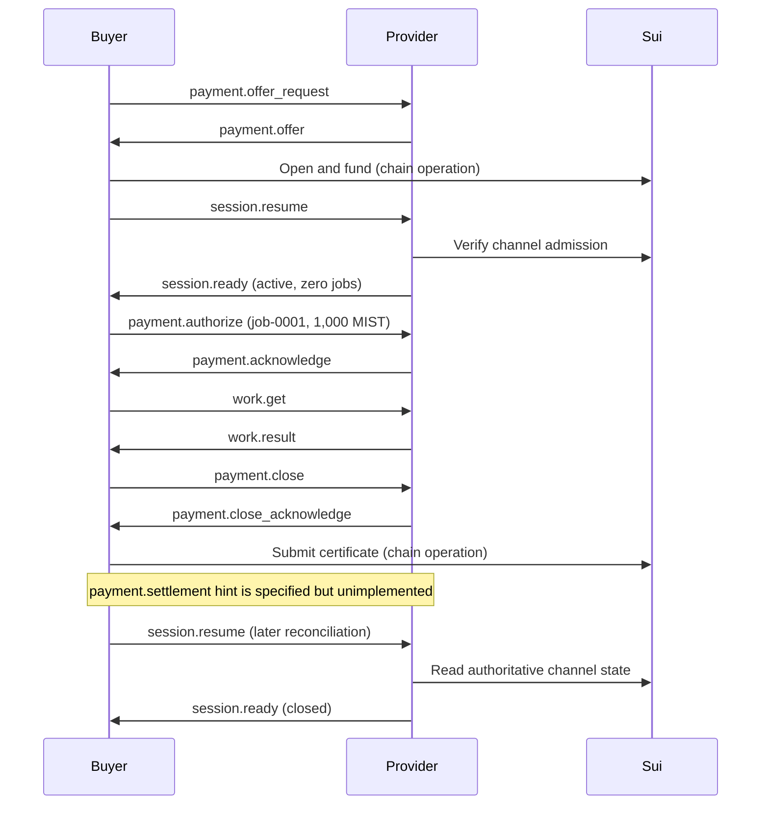

# m2m message examples

This directory contains separate native and legacy wire corpora. The legacy
corpus below has **23 exact JSON examples covering its 19 declared message
shapes**: 12 channel messages and 7 escrow request/response shapes. Four
additional examples show channel recovery states. These are offline wire fixtures,
not a live exchange or a script to send to a funded peer.

Every signed statement comes from the repository's public signing vectors. The
signatures verify, and the request, credit, result, and close references form a
coherent exchange. Object IDs, network, timestamps, and transaction digests are
synthetic. The fixed test keys are public; never fund them. No private operational
state is used to generate these files.

The implemented experimental [native core corpus](native-core/README.md) covers
ten envelope kinds, including unpaid messaging and service descriptions. The
[native streaming corpus](native-streaming/README.md) adds 32 signed envelopes
with economic statements, credit exhaustion/renewal, cancellation and rejection
branches. Their specifications and runtime status are linked in each corpus.
The separate [research conversation v2 corpus](research-conversation-v2/README.json)
tracks the new [agent-services binding](../../docs/AGENT_SERVICES_SPEC.md).
It does not replace the original research or economic wire formats.
They do not change the legacy formats below. The earlier
[core proposal](../../docs/CORE_MESSAGE_PROPOSAL.md) remains a design sketch, not
the implemented wire contract.

## Channel messages

These use Iroh ALPN `m2m/payment/1` and envelope method `sui.channel.v1`.
The [schema](../../schemas/channel-v1.schema.json),
[specification](../../docs/CHANNEL_SPEC.md), and
[runtime inventory](../../docs/research/M2M_MESSAGE_INVENTORY.md) define the contract.

The example requests a ceiling of ten jobs at 1,000 MIST each with a 12,000-MIST
deposit, performs **one** job, then closes early. The cooperative outcome would
pay 1,000 MIST and refund 11,000 MIST, excluding transaction gas. This differs from
the ten-job run in the PoC validation report because the public signing vector
contains one completed job.

| Message / exact JSON | Direction | Meaning | Runtime |
|---|---|---|---|
| [payment.offer_request](channel/payment.offer_request.json) | Buyer → provider | Ask for a fixture price, job ceiling, and deposit | Implemented |
| [payment.offer](channel/payment.offer.json) | Provider → buyer | Sign opening terms and commit to the fixture terms | Implemented |
| [session.resume](channel/session.resume.json) | Buyer → provider | Admit or recover an already funded channel | Implemented |
| [session.ready](channel/session.ready.json) | Provider → buyer | Report active state before the first credit | Implemented |
| [payment.authorize](channel/payment.authorize.json) | Buyer → provider | Sign cumulative credit bound to `job-0001` | Implemented |
| [payment.acknowledge](channel/payment.acknowledge.json) | Provider → buyer | Sign a durable receipt for that credit | Implemented |
| [work.get](channel/work.get.json) | Buyer → provider | Retrieve the request already backed by credit | Implemented |
| [work.result](channel/work.result.json) | Provider → buyer | Return fixture bytes and a signed request/credit binding | Implemented |
| [payment.close](channel/payment.close.json) | Buyer → provider | Sign the final cumulative amount and transcript | Implemented |
| [payment.close_acknowledge](channel/payment.close_acknowledge.json) | Provider → buyer | Return a jointly signed close certificate | Implemented |
| [payment.settlement](channel/payment.settlement.json) | Buyer → provider | Hint that a close transaction was submitted | **Specified only: no sender or handler** |
| [error](channel/error.json) | Provider → buyer | Report a conflicting repeated credit; alternative failure branch | Implemented |

The channel settlement message is an implementation gap: the spec describes
reconciling the hint against Sui and returning `session.ready`, but the runtime
does not handle it. A schema-valid example does not close that gap. The original
escrow's `settled` response, described below, is implemented.

### Follow the exchange



Opening/funding, transaction submission, unilateral redemption, and expiry refund
are Sui operations, not additional Iroh message types. In this method, the credit
is a redeemable advance: the provider can claim it even if delivery fails. The
acknowledgement does not establish delivery, correct work, or onchain payment.

### Recovery and alternative states

These are variants of `session.ready`, not new types or consecutive steps in a
single flow. A reconnect uses the same `session.resume` shape.

| Exact JSON | Situation |
|---|---|
| [session.ready.resumed](channel/session.ready.resumed.json) | One completed job, highest credit saved, no redemption yet |
| [session.ready.frozen](channel/session.ready.frozen.json) | Close certificate saved; further work frozen before observed settlement |
| [session.ready.closed](channel/session.ready.closed.json) | Cooperative close observed; 1,000 MIST redeemed |
| [session.ready.refunded](channel/session.ready.refunded.json) | Alternative path: unilateral redemption of 1,000 MIST, then expiry refund of the remainder; no cooperative certificate |

The error example is another alternative branch. It must not be inserted into the
successful sequence as evidence that the example credit conflicts with itself.
The full error vocabulary and recovery rules are in the channel specification;
this corpus covers message shapes, not every error code or possible execution.

## Original per-job escrow messages

These use Iroh ALPN `m2m/fixture/1`, with the original
[schema](../../schemas/exchange-v1.schema.json) and
[protocol](../../docs/PROTOCOL.md). Requests use `method`; responses use `kind`.
They do not use the channel envelope.

| Message / exact JSON | Meaning | Runtime |
|---|---|---|
| [Request: quote](escrow/request.quote.json) | Buyer requests a price for a known fixture hash | Implemented |
| [Response: quote](escrow/response.quote.json) | Provider signs 1,000-MIST escrow terms | Implemented |
| [Request: deliver](escrow/request.deliver.json) | Buyer requests delivery from a funded escrow | Implemented |
| [Response: result](escrow/response.result.json) | Provider returns fixture bytes | Implemented |
| [Request: accept](escrow/request.accept.json) | Buyer signs acceptance after verifying delivery | Implemented |
| [Response: settled](escrow/response.settled.json) | Provider reports settlement for that escrow | Implemented |
| [Response: error](escrow/response.error.json) | Alternative branch: the requested quote expired | Implemented |

The successful order is quote → fund on Sui → deliver → accept → settle on Sui →
settled response. Here acceptance follows delivery; its signature has different
economic meaning from a channel's prepaid credit. Both settlement examples use
the synthetic digest `11111111111111111111111111111111`; it is not transaction
evidence. A peer-supplied digest requires independent reconciliation.

## Reading the JSON

- Channel `buyer` and `provider` are fixed agreement roles, even in replies. They
  are not generic sender/recipient fields. The opening offer uses the zero
  `agreement_id`; funded messages reference the synthetic channel ID.
- `request_id` is `job-0001` on job messages and empty on session/close messages.
  Signed request descriptors encode this identifier as UTF-8 bytes.
- `u64` values, including amounts, sequences, and timestamps, are canonical decimal
  strings. Version fields and individual bytes are JSON numbers.
- Public keys, hashes, signatures, and signed text fields use byte arrays. Arrays
  are printed on one line without truncation. A `purpose` byte array decodes to a
  signing domain such as `m2m/channel/credit/v1`; `network` decodes to `test-vector`.
- Application signatures cover the **raw BCS encoding of the typed statement**,
  not JSON text, the outer envelope, or a Sui transaction intent. JSON whitespace
  does not change signed bytes. Hashes use Blake2b-256.
- Authenticated endpoint keys still need authorization by the relevant Sui Agent
  and agreement. Valid fixture signatures alone do not establish that authority.
- The work is the parameterless `FixedFile` handler returning
  [hello.txt](../../fixtures/hello.txt), at most 64 KiB. There is no generic task,
  prompt, input-argument, cancellation, or delegation message in today's profiles.

## Validate or regenerate

From the repository root, with the normal Rust toolchain available, install the
small schema-check dependency in an isolated environment if needed:

```sh
python3 -m venv .m2m/examples-venv
. .m2m/examples-venv/bin/activate
python3 -m pip install -r scripts/requirements-examples.txt
python3 scripts/message-examples.py --check
cargo test --locked --test message_examples
```

`npm run message-examples` runs the last two checks together. To deliberately
regenerate the checked-in files after reviewing changes to public vectors:

```sh
python3 scripts/message-examples.py --write
npm run message-examples
```

The generator reads only [channel signing vectors](../../fixtures/channel-signing-vectors.json),
[escrow signing vectors](../../fixtures/signing-vectors.json), and the fixture file.
It checks JSON Schema draft 2020-12, derives required message coverage from the
schemas, rejects unindexed wire examples, and verifies exact regeneration. Rust
checks deserialize every example through the real protocol types, verify all
embedded signatures, and check cross-message hashes, amounts, and transcripts.
These are offline consistency checks; they do not exercise networking, prove chain
authority, or imply a runtime handler exists. See the separate
[runtime validation](../../docs/CHANNEL_VALIDATION.md) for that evidence.

[index.json](index.json) is the machine-readable manifest. Its descriptions,
directions, and status labels are documentation metadata, never wire fields.
